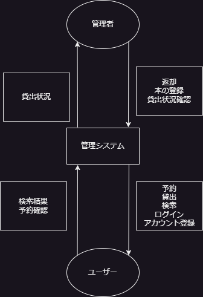
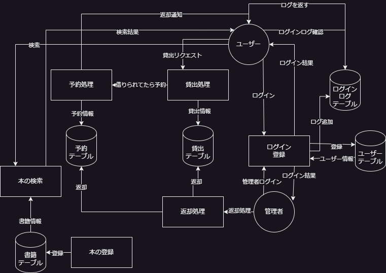
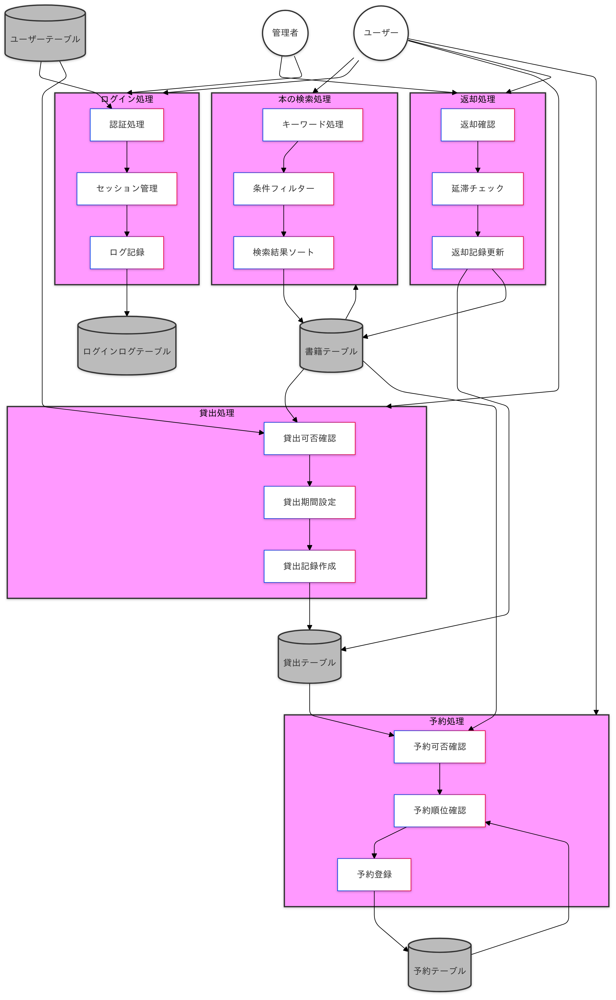
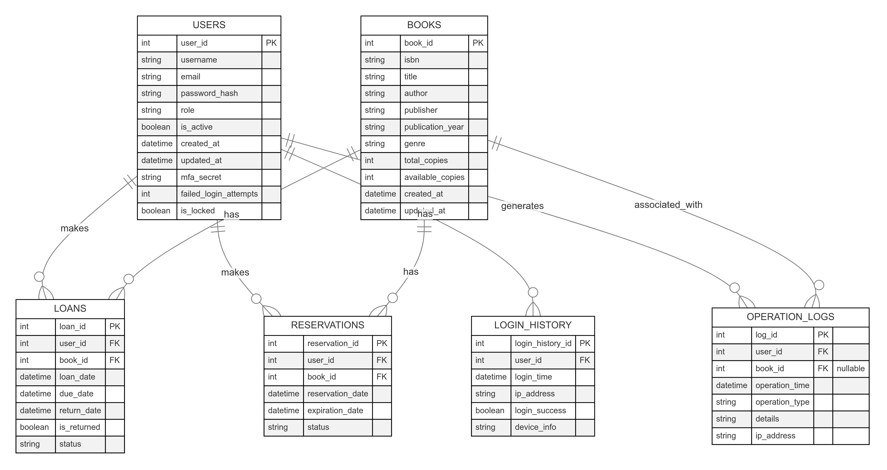
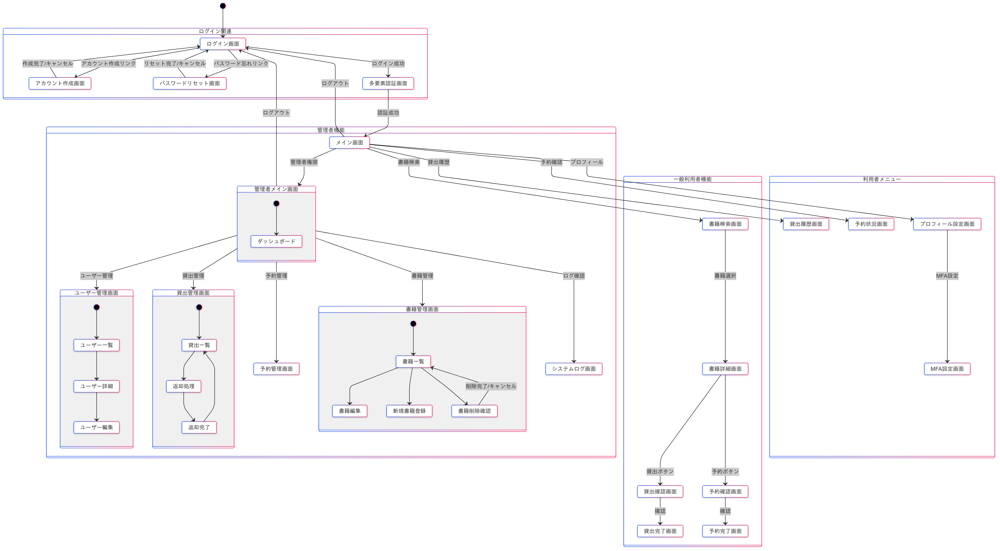

# 図書館管理システム 要件定義書

## 1. プロジェクト概要

### 目的
本の貸し借りをデータベースを使用して管理し、スムーズな貸し借りを行えるようにする。

### システム利用者
- **一般利用者**: 本の検索、貸し出し、返却機能を利用
- **管理者**: 本の貸し出し状況の確認、返却管理、ユーザー管理を実施、すでに借りられている場合に予約する

### 対象範囲
このシステムは、図書館内での書籍管理および貸し借りの管理を主な目的とし、利用者と管理者双方が効率的に操作できる環境を提供する。

### 期待される効果
- 手動管理に比べ、迅速な書籍管理と貸し借りが可能
- 利用者の利便性が向上し、貸し借りの履歴も管理しやすくなる
- 管理者が貸出状況を容易に把握でき、在庫管理が効率化される
- 現在ない本も今後借りることが可能になる

## 2. 機能要件
- 本の検索
- 貸し出し
- ログイン・アカウント作成
- 返却（管理者用）
- 貸し出し状況確認（管理者用）

## 3. システム環境
- **データベース**: MySQL
- **フレームワーク**: Spring MVC
- **セキュリティ**: Spring Security
- **テンプレートエンジン**: Thymeleaf
- **開発環境**: Eclipse IDE, VSCode
- **バージョン管理**: Git

## 4. セキュリティとヒューマンエラー防止要件

システムのセキュリティ要件に関する詳細な設計や対策については、[セキュリティ設計書](セキュリティ設計書.md)を参照してください。

## 5. 各種図

### ユースケース図

### DFD

#### レベル0

#### レベル1

#### レベル2

### ER図

### 画面遷移図

