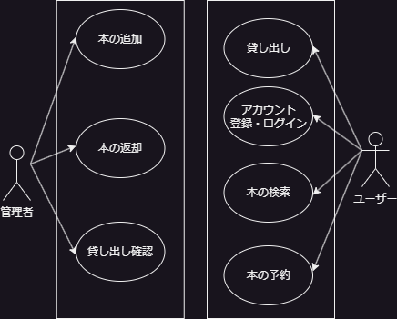

# 図書館管理システム 要件定義書

## 1. プロジェクト概要

### 目的
本の貸し借りをデータベースを使用して管理し、スムーズな貸し借りを行えるようにする。

### システム利用者
- **一般利用者**: 本の検索、貸し出し、返却機能を利用
- **管理者**: 本の貸し出し状況の確認、返却管理、ユーザー管理を実施、すでに借りられている場合に予約する

### 対象範囲
このシステムは、図書館内での書籍管理および貸し借りの管理を主な目的とし、利用者と管理者双方が効率的に操作できる環境を提供する。

### 期待される効果
- 手動管理に比べ、迅速な書籍管理と貸し借りが可能
- 利用者の利便性が向上し、貸し借りの履歴も管理しやすくなる
- 管理者が貸出状況を容易に把握でき、在庫管理が効率化される
- 現在ない本も今後借りることが可能になる

## 2. 機能要件
- 本の検索
- 貸し出し
- ログイン・アカウント作成
- 返却（管理者用）
- 貸し出し状況確認（管理者用）

## 3. システム環境
- **データベース**: MySQL
- **フレームワーク**: Spring MVC
- **セキュリティ**: Spring Security
- **テンプレートエンジン**: Thymeleaf
- **開発環境**: Eclipse IDE, VSCode
- **バージョン管理**: Git

## 4. セキュリティとヒューマンエラー防止要件

### セキュリティ要件
- **認証と認可**  
  - Spring Securityを用いてユーザーの認証と認可を行い、ユーザーと管理者でアクセスできる機能を制限する。

- **パスワードの暗号化**
  - ユーザーパスワードは、BCryptなどの暗号化アルゴリズムを使用してデータベースに保存し、パスワード漏洩リスクを最小限に抑える。

- **多要素認証（MFA）**
  - アカウントの保護を強化するために、メールまたはSMSでの二段階認証を導入。
  - Google Authenticatorによるコード認証を導入。

- **入力データのバリデーション**
  - SQLインジェクションやXSS攻撃を防ぐため、ユーザーからのすべての入力データにバリデーションとサニタイズ処理を施す。

- **セッション管理と同時ログインの制御**
  - 1ユーザーにつき、同時に1つのセッションのみが有効になるように設定し、2つ以上の端末での同時ログインを禁止する。
  - ユーザーが新たにログインすると、以前のセッションを自動的に無効化する。

- **IPアドレスの記録と不正ログイン対策**
  - 各ログイン時にユーザーのIPアドレスを記録し、一定回数以上の失敗ログインや不審なIPアドレスからのアクセスを検知した際にはアカウントをロックする。
  - アカウントロック時には、ユーザーに対してアカウントロック通知を送信する。

- **セッション管理**
  - セッションタイムアウトやトークン管理を行い、不正なセッションを防止。一定時間操作がない場合は自動ログアウト。

### ヒューマンエラー防止要件
- **入力チェックとフィードバック**
  - すべてのフォーム入力に対し、必須項目やフォーマットのチェックを行い、ユーザーが誤入力を行った際にリアルタイムでエラーメッセージを表示。

- **確認ダイアログの追加**
  - 貸し出し、返却、予約などの重要な操作に確認ダイアログを表示し、誤操作を防止。

- **操作ログの記録**
  - 貸し出し、返却、アカウント作成などの操作を操作ログとして記録し、管理者が不正操作やエラーをトレースできるようにする。

- **ロールバック機能**
  - データベーストランザクションを活用し、エラー発生時に処理をロールバックすることで、データの一貫性を保持。

## 5. 各種図

### ユースケース図

### DFD

#### レベル0

#### レベル1

#### レベル2

